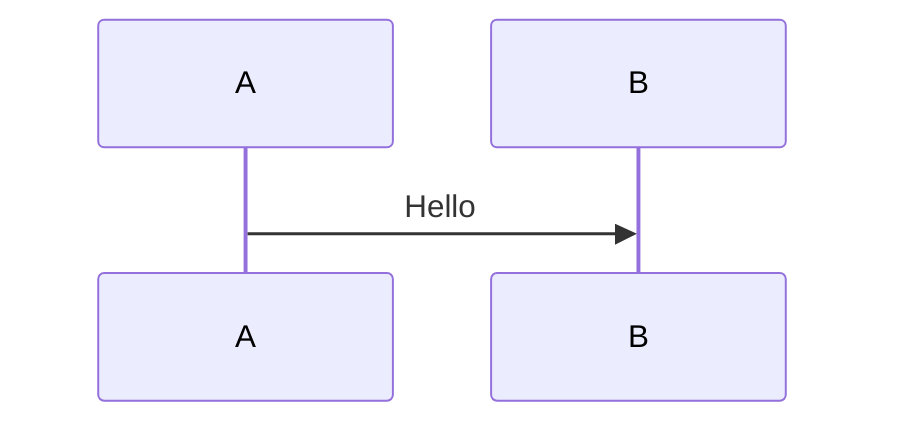

# Presenterm Presentation

Use this skill to create or modify slide decks for [Presenterm](https://mfontanini.github.io/presenterm/print.html), a terminal-based presentation tool that uses Markdown as the source format.

## What this skill should produce

Prefer producing these deliverables:

1. A primary presentation file such as `deck.md` or `<topic>.md`
2. Optional supporting files only when needed:
   - a theme YAML file
   - local images/assets
   - included markdown partials
3. Clear run/export commands for the user
4. References to further documentation

## Before you start

Capture the details the user already gave you, then fill the gaps only if they matter:

1. Presentation goal and audience
2. Expected length or timebox
3. Output path / filename
4. Whether the user wants:
   - only the slide source
   - a runnable deck
   - exported HTML/PDF
   - speaker notes
   - a custom theme
5. Whether assets already exist locally

If the user did not specify these, use sensible defaults and state them briefly.

## Read the bundled reference when needed

Read `references/presenterm-reference.md` whenever:

- you need exact Presenterm syntax
- the user asks about themes, Mermaid, speaker notes, exports, layouts, or code execution
- you are unsure whether a feature is supported

## Workflow

1. Define the deliverable.
   - If the user wants a presentation, create a single Markdown deck first.
   - Add extra files only when the requested styling or behavior needs them.

2. Structure the deck for Presenterm.
   - Use one Markdown file as the source of truth.
   - Separate slides with:

```html
<!-- end_slide -->
```

3. Write slides for terminal presentation, not for PowerPoint.
   - Keep slides visually sparse.
   - Favor concise bullets, short code samples, and strong slide titles.
   - Break dense content into more slides instead of overpacking one slide.

4. Use Presenterm-native features instead of ad-hoc HTML.
   - Use comment commands such as `pause`, `incremental_lists`, `column_layout`, `column`, `reset_layout`, and `speaker_note`.
   - Prefer Presenterm themes and layout commands over unsupported HTML structures.

5. Make the deck runnable.
   - If `presenterm` is installed, provide or run the exact command needed.
   - During authoring, prefer plain `presenterm <file>.md` so hot reload remains available.
   - For actual presentation mode, use `presenterm --present <file>.md`.

6. If export is requested, choose the right output.
   - HTML: `presenterm --export-html <file>.md`
   - PDF: `presenterm --export-pdf <file>.md` and note that `weasyprint` is required

7. End with references.
   - Point the user to the official docs, examples, and the most relevant feature sections.

## Authoring guidance

### Presentation skeleton

Use this structure as a starting point when creating a new deck:

```markdown
---
title: My Presentation
sub_title: Optional subtitle
author: Your Name
theme:
  name: dark
---

Opening
=======

- Why this matters
- What the audience should learn

<!-- end_slide -->

Agenda
======

<!-- incremental_lists: true -->

- Problem
- Approach
- Demo
- Q&A

<!-- end_slide -->

Architecture
============

<!-- column_layout: [2, 1] -->
<!-- column: 0 -->

- Key decision 1
- Key decision 2
- Key trade-off

<!-- column: 1 -->


<!-- reset_layout -->

<!-- end_slide -->

Thanks
======
```

### Titles and headings

- Use slide-sized titles for separator slides and key moments.
- Prefer short, high-signal slide titles.
- Use regular headings and bullets only when they improve readability.

### Pauses and reveal behavior

Use pauses when progressive disclosure helps comprehension:

```html
<!-- pause -->
```

For bullet-heavy slides, prefer:

```html
<!-- incremental_lists: true -->
```

This is usually clearer and less tedious than placing a pause between every bullet.

### Layouts

For side-by-side content, use Presenterm column commands instead of HTML:

```html
<!-- column_layout: [3, 2] -->
<!-- column: 0 -->
<!-- column: 1 -->
<!-- reset_layout -->
```

Use columns for:
- text + image
- explanation + code
- comparison slides

### Images

- Keep images local; remote images are not supported.
- Use relative paths from the presentation file.
- Resize intentionally with image attributes such as:

```markdown

```

- If the user is in tmux and images matter, mention that passthrough support may need to be enabled.

### Mermaid and diagrams

If the user wants diagrams inside the deck, Mermaid can be rendered with:

````markdown

````

Explain that this requires `mermaid-cli`. Prefer simple, readable diagrams. If diagram rendering quality matters, mention that scale can be adjusted in configuration and width can be controlled per diagram.

### Speaker notes

If speaker notes are requested, add them with comment commands:

```html
<!-- speaker_note: key point to remember -->
```

For multiline notes, use the YAML-style block comment format described in the reference file.

If the user wants a presenter/notes setup, provide both commands:

```bash
presenterm deck.md --publish-speaker-notes
presenterm deck.md --listen-speaker-notes
```

### Themes

Prefer built-in themes first. Only create a custom theme file when the user explicitly wants custom styling or a branded look.

Use either:

```yaml
---
theme:
  name: dark
---
```

or a custom theme path when needed.

### Exporting

For sharing, prefer:
- HTML export when the user wants a portable artifact without extra dependencies
- PDF export when the user explicitly needs PDF and `weasyprint` is available

Provide exact commands, for example:

```bash
presenterm deck.md
presenterm --present deck.md
presenterm --export-html deck.md --output deck.html
uv run --with weasyprint presenterm --export-pdf deck.md --output deck.pdf
```

## Best practices

- Optimize for speaking, not reading.
- Keep each slide focused on one idea.
- Prefer more slides with less text over fewer slides with dense paragraphs.
- Use local assets and stable relative paths so the deck is portable.
- Use Presenterm comments and layouts instead of unsupported HTML tricks.
- Use hot reload while drafting; switch to `--present` when rehearsing or presenting.
- Be explicit about optional dependencies such as `weasyprint` and `mermaid-cli`.
- If code execution is requested, explain that executable snippets exist but should be enabled deliberately because they can run arbitrary code.

## Output format

Unless the user asks for something else, finish with this structure:

````md
## Deliverables
- `path/to/deck.md`
- `path/to/theme.yaml` (if any)

## Run
```bash
presenterm path/to/deck.md
```

## Present
```bash
presenterm --present path/to/deck.md
```

## Export
```bash
presenterm --export-html path/to/deck.md --output path/to/deck.html
```

## References
- Official docs: https://mfontanini.github.io/presenterm/print.html
- Examples: https://github.com/mfontanini/presenterm/tree/master/examples
````

## Notes for the model using this skill

- Do not invent Presenterm syntax. If unsure, read `references/presenterm-reference.md`.
- Prefer a working, simple deck over an overengineered one.
- If the user asks for a Presenterm presentation and gives only content, turn that content into a clean deck and include the run commands.
- If the user asks for "slides" in a terminal/markdown context, strongly consider this skill even if they did not explicitly mention Presenterm.
