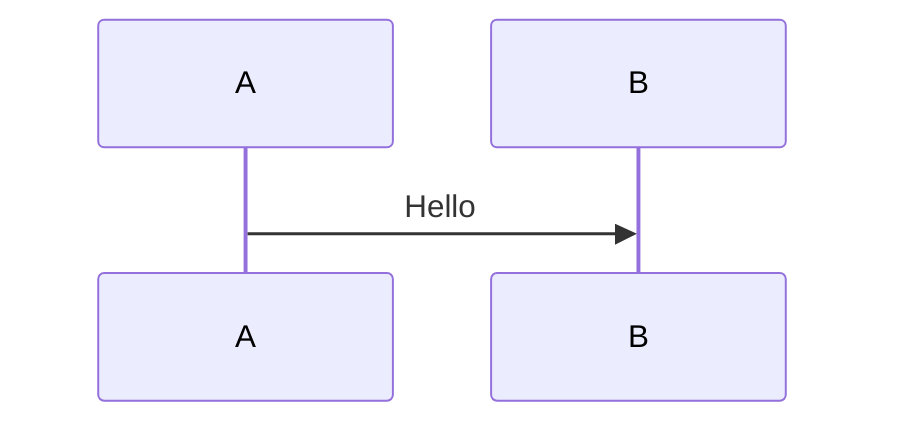

# Presenterm Presentation

Use this skill to create or modify slide decks for [Presenterm](https://mfontanini.github.io/presenterm/print.html), a terminal-based presentation tool that uses Markdown as the source format.

## Default house style

Unless the user explicitly asks for something else, use these defaults for every new or refactored deck:

1. Always include front matter with `title`, `sub_title`, and `author`.
2. Use slide titles as Setext headings with `---`, not `======`.
3. Start each slide with `<!-- alignment: center -->`.
4. Place `<!-- jump_to_middle -->` near the top of each slide, typically right after the title.
5. Keep slides very clean and very small.
6. Prefer more slides over denser slides.

If the user does not provide `title`, `sub_title`, or `author`, derive concise defaults from the context and state that briefly.

## What this skill should produce

Prefer producing these deliverables:

1. A primary presentation file such as `deck.md` or `<topic>.md`
2. Optional supporting files only when needed:
   - a theme YAML file
   - local images/assets
   - included markdown partials
3. Clear run/export commands for the user
4. References to further documentation

## Before you start

Capture the details the user already gave you, then fill the gaps only if they matter:

1. Presentation goal and audience
2. Expected length or timebox
3. Output path / filename
4. Title, subtitle, and author values for front matter
5. Whether the user wants:
   - only the slide source
   - a runnable deck
   - exported HTML/PDF
   - speaker notes
   - a custom theme
6. Whether assets already exist locally

If the user did not specify these, use sensible defaults and state them briefly.

## Read the bundled reference when needed

Read `references/presenterm-reference.md` whenever:

- you need exact Presenterm syntax
- the user asks about themes, Mermaid, speaker notes, exports, layouts, alignment, or comment commands
- you are unsure whether a feature is supported

## Workflow

1. Define the deliverable.
   - If the user wants a presentation, create a single Markdown deck first.
   - Add extra files only when the requested styling or behavior needs them.

2. Structure the deck with the house style first.
   - Always include front matter with `title`, `sub_title`, and `author`.
   - Use one Markdown file as the source of truth.
   - Separate slides with:

```html
<!-- end_slide -->
```

3. Apply the default slide pattern.
   - Use `<!-- alignment: center -->` on every slide unless the user asked otherwise.
   - Use a slide title with `---`.
   - Use `<!-- jump_to_middle -->` unless the user asked otherwise.
   - Keep slide bodies short and visually sparse.

4. Write slides for terminal presentation, not for PowerPoint.
   - Keep each slide focused on one idea.
   - Favor concise bullets, short code samples, and short comparison points.
   - Break dense content into more slides instead of overpacking one slide.
   - Avoid long paragraphs, oversized tables, or large code listings unless explicitly requested.

5. Use Presenterm-native features instead of ad-hoc HTML.
   - Use comment commands such as `pause`, `incremental_lists`, `column_layout`, `column`, `reset_layout`, and `speaker_note`.
   - Prefer Presenterm themes and layout commands over unsupported HTML structures.

6. Make the deck runnable.
   - If `presenterm` is installed, provide or run the exact command needed.
   - During authoring, prefer plain `presenterm <file>.md` so hot reload remains available.
   - For actual presentation mode, use `presenterm --present <file>.md`.

7. If export is requested, choose the right output.
   - HTML: `presenterm --export-html <file>.md`
   - PDF: `presenterm --export-pdf <file>.md` and note that `weasyprint` is required

8. End with references.
   - Point the user to the official docs, examples, and the most relevant feature sections.

## Canonical deck pattern

Use this as the default template unless the user asks for a different layout:

````markdown
---
title: Presentation Title
sub_title: Short subtitle
author: Author Name
---

<!-- alignment: center -->
Opening
---

<!-- jump_to_middle -->

- One core point
- One supporting point
- One outcome

<!-- end_slide -->

<!-- alignment: center -->
Key idea
---

<!-- jump_to_middle -->

```csharp
var dto = mapper.Map<UserDto>(user);
```

<!-- end_slide -->

<!-- alignment: center -->
Wrap-up
---

<!-- jump_to_middle -->

- Recommendation
- Next step
````

## Authoring guidance

### Front matter

Always include this block:

```yaml
---
title: My Presentation
sub_title: Short subtitle
author: Your Name
---
```

Add theme configuration only when needed.

### Slide titles

Prefer this exact pattern for slide titles:

```markdown
Slide title
---
```

Use a title on every slide. Keep titles short and high-signal.

### Slide sizing

Default to one of these per slide:

- 1 short statement
- 2-3 short bullets
- 1 small code sample
- 1 tiny comparison table
- 1 image or diagram with minimal supporting text

If content exceeds that shape, split it into multiple slides.

### Alignment and vertical placement

Unless the user asks otherwise, use:

```html
<!-- alignment: center -->
```

and:

```html
<!-- jump_to_middle -->
```

This keeps slides visually clean and centered, which matches the preferred style in this workspace.

### Pauses and reveal behavior

Use pauses only when progressive disclosure genuinely helps comprehension:

```html
<!-- pause -->
```

For bullet-heavy slides, prefer:

```html
<!-- incremental_lists: true -->
```

But do not use reveal mechanics to compensate for overcrowded slides. Split the slide instead.

### Layouts

For side-by-side content, use Presenterm column commands instead of HTML:

```html
<!-- column_layout: [3, 2] -->
<!-- column: 0 -->
<!-- column: 1 -->
<!-- reset_layout -->
```

Only switch away from centered single-column slides when the user explicitly asks for it.

### Images

- Keep images local; remote images are not supported.
- Use relative paths from the presentation file.
- Resize intentionally with image attributes such as:

```markdown

```

- If the user is in tmux and images matter, mention that passthrough support may need to be enabled.

### Mermaid and diagrams

If the user wants diagrams inside the deck, Mermaid can be rendered with:

````markdown

````

Explain that this requires `mermaid-cli`. Prefer simple, readable diagrams. If a diagram becomes dense, split the concept across slides instead of forcing one large visual.

### Speaker notes

If speaker notes are requested, add them with comment commands:

```html
<!-- speaker_note: key point to remember -->
```

For multiline notes, use the YAML-style block comment format described in the reference file.

If the user wants a presenter/notes setup, provide both commands:

```bash
presenterm deck.md --publish-speaker-notes
presenterm deck.md --listen-speaker-notes
```

### Themes

Prefer built-in themes first. Only create a custom theme file when the user explicitly wants custom styling or a branded look.

Use either:

```yaml
---
theme:
  name: dark
---
```

or a custom theme path when needed.

### Exporting

For sharing, prefer:

- HTML export when the user wants a portable artifact without extra dependencies
- PDF export when the user explicitly needs PDF and `weasyprint` is available

Provide exact commands, for example:

```bash
presenterm deck.md
presenterm --present deck.md
presenterm --export-html deck.md --output deck.html
uv run --with weasyprint presenterm --export-pdf deck.md --output deck.pdf
```

## Best practices

- Optimize for speaking, not reading.
- Keep each slide focused on one idea.
- Keep slides clean, small, and centered by default.
- Use local assets and stable relative paths so the deck is portable.
- Use Presenterm comments and layouts instead of unsupported HTML tricks.
- Use hot reload while drafting; switch to `--present` when rehearsing or presenting.
- Be explicit about optional dependencies such as `weasyprint` and `mermaid-cli`.
- Do not let slides become dense just because Presenterm supports rich layout commands.
- If a slide starts feeling busy, split it.

## Output format

Unless the user asks for something else, finish with this structure:

````md
## Deliverables
- `path/to/deck.md`
- `path/to/theme.yaml` (if any)

## Run
```bash
presenterm path/to/deck.md
```

## Present
```bash
presenterm --present path/to/deck.md
```

## Export
```bash
presenterm --export-html path/to/deck.md --output path/to/deck.html
```

## References
- Official docs: https://mfontanini.github.io/presenterm/print.html
- Examples: https://github.com/mfontanini/presenterm/tree/master/examples
````

## Notes for the model using this skill

- Do not invent Presenterm syntax. If unsure, read `references/presenterm-reference.md`.
- Prefer a working, simple deck over an overengineered one.
- If the user asks for a Presenterm presentation and gives only content, turn that content into a clean deck and include the run commands.
- The default style in this workspace is: front matter with `title` / `sub_title` / `author`, slide titles with `---`, centered alignment, `jump_to_middle`, and very small slides.
- If the user asks for "slides" in a terminal/markdown context, strongly consider this skill even if they did not explicitly mention Presenterm.
