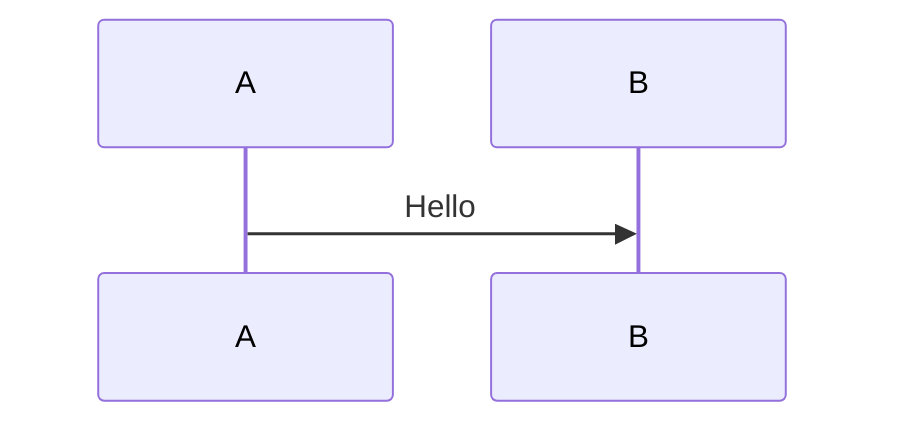

# Presenterm Presentation

Use this skill to create or modify slide decks for [Presenterm](https://mfontanini.github.io/presenterm/print.html), a terminal-based presentation tool that uses Markdown as the source format.

## Default house style

Unless the user explicitly asks for something else, use these defaults for every new or refactored deck:

1. Always include front matter with `title`, `sub_title`, `author`, and default `options.list_item_newlines: 2`.
2. Do not create a duplicate title slide unless the user explicitly asks for one; the title slide comes from the front matter.
3. Use slide titles as Setext headings with `---`, not `======`.
4. Start each slide with `<!-- alignment: center -->` unless the slide needs a different layout.
5. Use `<!-- jump_to_middle -->` only on divider or transition slides, or other very sparse slides with at most 1-3 short visible content lines.
6. Keep slides very clean and very small.
7. Prefer more slides over denser slides.
8. For live talks, default to speaker notes so the slides stay light and the speaking depth lives off-slide.
9. Treat these as defaults, not laws. If clarity, story flow, or audience needs call for a different layout, adapt deliberately.

If the user does not provide `title`, `sub_title`, or `author`, derive concise defaults from the context and state that briefly.

## What this skill should produce

Prefer producing these deliverables:

1. A primary presentation file such as `deck.md` or `<topic>.md`
2. Optional supporting files only when needed:
   - a theme YAML file
   - local images/assets
   - included markdown partials
3. Clear run/export commands for the user
4. References to further documentation

## Before you start

Capture the details the user already gave you, then fill the gaps only if they matter:

1. Presentation goal and audience
2. Delivery mode: live talk, workshop, demo session, recorded talk, or async readout
3. Expected length or timebox
4. Output path / filename
5. Title, subtitle, and author values for front matter
6. Whether the user wants:
   - only the slide source
   - a runnable deck
   - exported HTML/PDF
   - speaker notes
   - a custom theme
7. Whether demos, discussion prompts, or audience interaction make sense
8. Whether assets already exist locally

If the user did not specify these, use sensible defaults and state them briefly.

## Presentation quality defaults

When the user has not asked for a specific presentation style, optimize for presentation quality first and Presenterm style second. Use these defaults:

1. Start from audience and outcome.
   - Ask what the audience should understand, remember, or do afterward.

2. Give the deck a light narrative arc.
   - Default to: hook, orientation, 2-4 main sections, demo or interaction when useful, takeaways, and close/Q&A.

3. Keep slides speaker-led.
   - Slides should carry cues, visuals, evidence, short examples, and prompts.
   - Notes should carry nuance, transitions, examples, and delivery reminders.

4. Keep one main idea per slide.
   - If a slide is teaching multiple new ideas, split it.

5. Make transitions explicit.
   - Use short section dividers, agenda/map slides, and takeaways so the audience does not have to infer the structure.

6. Prefer concrete material over prose.
   - Use diagrams, images, before/after comparisons, short code, or crisp bullets instead of paragraphs.

7. Recommend interaction for live formats when it helps.
   - Good defaults include a quick pulse check, a discussion prompt, a show-of-hands question, or a short demo with a clear point.

8. Avoid common presentation failure modes lightly but clearly.
   - Do not make the audience read dense paragraphs while you talk.
   - Do not let one slide carry multiple unrelated jobs.
   - Do not include a demo or interaction without a clear reason to exist.

## Read the bundled reference when needed

Read `references/presenterm-reference.md` whenever:

- you need exact Presenterm syntax
- the user asks about themes, Mermaid, speaker notes, exports, layouts, alignment, or comment commands
- you are unsure whether a feature is supported

## Workflow

1. Define the deliverable and presentation mode.
   - If the user wants a presentation, create a single Markdown deck first.
   - Decide whether the deck is for a live talk, workshop, demo-heavy session, or async readout.
   - Add extra files only when the requested styling or behavior needs them.

2. Shape the story before writing slides.
   - Default to a light arc: hook, orientation, main sections, demo/interaction when useful, takeaways, and close/Q&A.
   - For longer talks, group slides into clear clusters and add transition slides between them.

3. Structure the deck with the house style first.
   - Always include front matter with `title`, `sub_title`, `author`, and default `options.list_item_newlines: 2`.
   - Let the front matter provide the title slide unless the user explicitly wants a custom opener.
   - Use one Markdown file as the source of truth.
   - Separate slides with:

```html
<!-- end_slide -->
```

4. Apply the default slide pattern.
   - Use `<!-- alignment: center -->` on every slide unless the user asked otherwise.
   - Use a slide title with `---`.
   - Use `<!-- jump_to_middle -->` only on divider, transition, or similarly sparse slides with at most 1-3 short visible content lines.
   - Keep slide bodies short and visually sparse.

5. Write slides for speaking, not reading.
   - Keep each slide focused on one idea.
   - Favor concise bullets, short code samples, small comparisons, strong visuals, and explicit takeaways.
   - Break dense content into more slides instead of overpacking one slide.
   - Put nuance, transitions, and delivery detail into speaker notes instead of the visible slide whenever possible.

6. Use Presenterm-native features instead of ad-hoc HTML.
   - Use comment commands such as `pause`, `incremental_lists`, `column_layout`, `column`, `reset_layout`, and `speaker_note`.
   - Prefer Presenterm themes and layout commands over unsupported HTML structures.

7. Add delivery support for live talks.
   - Default to speaker notes.
   - Use `pause` and `incremental_lists` only when progressive disclosure genuinely helps.
   - Recommend interaction, discussion prompts, demos, or Q&A slides when they improve attention or comprehension.

8. Make the deck runnable.
   - If `presenterm` is installed, provide or run the exact command needed.
   - During authoring, prefer plain `presenterm <file>.md` so hot reload remains available.
   - For actual presentation mode, use `presenterm --present <file>.md`.

9. If export is requested, choose the right output.
   - HTML: `presenterm --export-html <file>.md`
   - PDF: `presenterm --export-pdf <file>.md` and note that `weasyprint` is required

10. Run a short presentation-quality self-check.
   - Is the audience and outcome clear?
   - Does each slide do one main job?
   - Are transitions and takeaways explicit?
   - Are visuals, density, and code samples readable from a distance?
   - Do demos, interactions, and reveal mechanics serve a real purpose?

11. End with references.
   - Point the user to the official docs, examples, and the most relevant feature sections.

## Canonical deck pattern

Use this as the default template unless the user asks for a different layout:

````markdown
---
title: Presentation Title
sub_title: Short subtitle
author: Author Name
options:
  list_item_newlines: 2
---

<!-- alignment: center -->
Opening
---

- One core point
- One supporting point
- One outcome

<!-- end_slide -->

<!-- alignment: center -->
Key idea
---

```csharp
var dto = mapper.Map<UserDto>(user);
```

<!-- end_slide -->

<!-- alignment: center -->
Wrap-up
---

- Recommendation
- Next step
````

## Light presentation arc

Use this default arc when the user asks for a talk and gives only rough content:

1. Opening / hook
2. Why this matters / orientation
3. 2-4 main topic clusters
4. Demo, audience interaction, or discussion moment when useful
5. Practical takeaways
6. Q&A or closing

Within each topic cluster, prefer a rhythm like:
- cluster title or transition slide
- 2-5 focused content slides
- optional demo or discussion prompt
- quick takeaway before moving on

This keeps the deck easy to follow and matches the strongest patterns from a good live Presenterm talk.

## Authoring guidance

### Front matter

Always include this block:

```yaml
---
title: My Presentation
sub_title: Short subtitle
author: Your Name
options:
  list_item_newlines: 2
---
```

The title slide comes from this front matter, so do not add a duplicate title slide unless the user explicitly wants one.

Add theme configuration only when needed.

### Slide titles

Prefer this exact pattern for slide titles:

```markdown
Slide title
---
```

Use a title on every slide. Keep titles short and high-signal.

### Slide sizing

Default to one of these per slide:

- 1 short statement
- 2-3 short bullets
- 1 small code sample
- 1 tiny comparison table
- 1 image or diagram with minimal supporting text
- 1 discussion or demo prompt

If content exceeds that shape, split it into multiple slides.

### Alignment and vertical placement

Unless the user asks otherwise, use:

```html
<!-- alignment: center -->
```

Use:

```html
<!-- jump_to_middle -->
```

only on divider, transition, or otherwise very sparse slides with at most 1-3 short visible content lines. Do not use it as a blanket default for normal content slides.

This keeps slides visually clean and centered without forcing dense slides into a layout meant for minimal content.

### Pauses and reveal behavior

Use pauses only when progressive disclosure genuinely helps comprehension:

```html
<!-- pause -->
```

For bullet-heavy slides, prefer:

```html
<!-- incremental_lists: true -->
```

But do not use reveal mechanics to compensate for overcrowded slides. Split the slide instead.

### Layouts

For side-by-side content, use Presenterm column commands instead of HTML:

```html
<!-- column_layout: [3, 2] -->
<!-- column: 0 -->
<!-- column: 1 -->
<!-- reset_layout -->
```

Only switch away from centered single-column slides when the user explicitly asks for it.

### Images

- Keep images local; remote images are not supported.
- Use relative paths from the presentation file.
- Resize intentionally with image attributes such as:

```markdown

```

- If the user is in tmux and images matter, mention that passthrough support may need to be enabled.

### Mermaid and diagrams

If the user wants diagrams inside the deck, Mermaid can be rendered with:

````markdown

````

Explain that this requires `mermaid-cli`. Prefer simple, readable diagrams. If a diagram becomes dense, split the concept across slides instead of forcing one large visual.

For Mermaid flowcharts, do not default to `LR`. Use left-to-right flow only when the content is naturally a horizontal pipeline, comparison, or progression. Otherwise prefer the orientation that best matches the content, which is often top-down.

### Speaker notes

For live talks, default to speaker notes even if the user did not explicitly request them, unless they want a slide-only deliverable.

Add notes with comment commands such as:

```html
<!-- speaker_note: key point to remember -->
```

For multiline notes, use the YAML-style block comment format described in the reference file.

Use notes for:
- transitions between sections
- examples or anecdotes that would clutter the slide
- demo cues and timing reminders
- audience prompts or facilitation hints
- the one sentence you want to land before leaving the slide

If the user wants a presenter/notes setup, provide both commands:

```bash
presenterm deck.md --publish-speaker-notes
presenterm deck.md --listen-speaker-notes
```

### Themes

Prefer built-in themes first. Only create a custom theme file when the user explicitly wants custom styling or a branded look.

Use either:

```yaml
---
theme:
  name: dark
---
```

or a custom theme path when needed.

### Exporting

For sharing, prefer:

- HTML export when the user wants a portable artifact without extra dependencies
- PDF export when the user explicitly needs PDF and `weasyprint` is available

Provide exact commands, for example:

```bash
presenterm deck.md
presenterm --present deck.md
presenterm --export-html deck.md --output deck.html
uv run --with weasyprint presenterm --export-pdf deck.md --output deck.pdf
```

## Best practices

- Optimize for audience understanding, energy, and takeaways together.
- Optimize for speaking, not reading.
- Start early by telling the audience why the topic matters and what to expect.
- Keep each slide focused on one idea and one job.
- Keep slides clean, small, and centered by default.
- Use section dividers, orientation slides, and takeaway slides so the structure stays obvious.
- Prefer visuals, diagrams, before/after comparisons, and small code samples over prose-heavy explanation.
- For live talks, use speaker notes, short demos, and audience interaction to create rhythm.
- Use `pause` and `incremental_lists` to focus attention, not to rescue overcrowded slides.
- Use local assets and stable relative paths so the deck is portable.
- Use Presenterm comments and layouts instead of unsupported HTML tricks.
- Use hot reload while drafting; switch to `--present` when rehearsing or presenting.
- Be explicit about optional dependencies such as `weasyprint` and `mermaid-cli`.
- If a slide starts feeling busy, confusing, or multi-purpose, split it.

## Output format

Unless the user asks for something else, finish with this structure:

````md
## Deliverables
- `path/to/deck.md`
- `path/to/theme.yaml` (if any)

## Run
```bash
presenterm path/to/deck.md
```

## Present
```bash
presenterm --present path/to/deck.md
```

## Export
```bash
presenterm --export-html path/to/deck.md --output path/to/deck.html
```

## References
- Official docs: https://mfontanini.github.io/presenterm/print.html
- Examples: https://github.com/mfontanini/presenterm/tree/master/examples
````

## Notes for the model using this skill

- Do not invent Presenterm syntax. If unsure, read `references/presenterm-reference.md`.
- Prefer a working, simple deck over an overengineered one.
- If the user asks for a Presenterm presentation and gives only content, turn that content into a clean deck and include the run commands.
- The default style in this workspace is: front matter with `title` / `sub_title` / `author` plus `options.list_item_newlines: 2`, title slide from front matter, slide titles with `---`, centered alignment, `jump_to_middle` only for sparse divider-style slides, very small slides, and speaker notes for live talks.
- Presentation quality and audience comprehension matter at least as much as strict adherence to house style. Balance both.
- If the user asks to improve an existing deck, actively simplify dense slides, clarify structure, strengthen transitions, and make takeaways more explicit.
- If the user asks for "slides" in a terminal/markdown context, strongly consider this skill even if they did not explicitly mention Presenterm.
