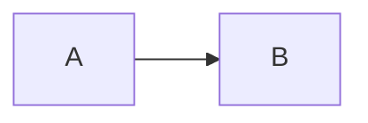

# Presenterm Reference

A concise reference for creating and running Presenterm slide decks.

## Official sources

- Official documentation: https://mfontanini.github.io/presenterm/print.html
- GitHub repository: https://github.com/mfontanini/presenterm
- Example presentations: https://github.com/mfontanini/presenterm/tree/master/examples

## Most useful doc sections

- Quick start: https://mfontanini.github.io/presenterm/print.html#quick-start
- Presentations and slide structure: https://mfontanini.github.io/presenterm/print.html#presentations
- Comment commands: https://mfontanini.github.io/presenterm/print.html#comment-commands
- Layouts / columns: https://mfontanini.github.io/presenterm/print.html#layouts
- Images: https://mfontanini.github.io/presenterm/print.html#images
- Code highlighting: https://mfontanini.github.io/presenterm/print.html#code-highlighting
- Mermaid: https://mfontanini.github.io/presenterm/print.html#mermaid
- Themes: https://mfontanini.github.io/presenterm/print.html#themes
- Exporting: https://mfontanini.github.io/presenterm/print.html#exporting-presentations
- Speaker notes: https://mfontanini.github.io/presenterm/print.html#speaker-notes
- Configuration: https://mfontanini.github.io/presenterm/print.html#configuration

## Installation

### macOS

```bash
brew install presenterm
```

### Cargo

```bash
cargo binstall presenterm
# or
cargo install --locked presenterm
```

## Core usage

### Run in authoring mode with hot reload

```bash
presenterm deck.md
```

By default, Presenterm reloads the presentation when the file changes. This is useful while drafting.

### Run in presentation mode

```bash
presenterm --present deck.md
```

### Export HTML

```bash
presenterm --export-html deck.md --output deck.html
```

HTML export is self-contained and does not require extra dependencies.

### Export PDF

```bash
presenterm --export-pdf deck.md --output deck.pdf
```

PDF export requires `weasyprint`. A convenient variant is:

```bash
uv run --with weasyprint presenterm --export-pdf deck.md --output deck.pdf
```

## Presentation file structure

A Presenterm deck is a single Markdown file. Slides are separated with:

```html
<!-- end_slide -->
```

Preferred house-style example used by this skill:

````markdown
---
title: Demo Deck
sub_title: Short subtitle
author: Matthias
---

<!-- alignment: center -->
Intro
---

- Goal
- Scope
- Outcome

<!-- end_slide -->

<!-- alignment: center -->
Deep Dive
---

- Point 1
- Point 2
````

## Important syntax

### Front matter

```yaml
---
title: "My _first_ **presentation**"
sub_title: Optional subtitle
author: Myself
---
```

This skill's default style is to always include `title`, `sub_title`, and `author`.

### Slide titles

Setext headers are treated like slide titles. Prefer the compact style:

```markdown
Agenda
---
```

### Alignment

```html
<!-- alignment: left -->
<!-- alignment: center -->
<!-- alignment: right -->
```

### Vertical placement

```html
<!-- jump_to_middle -->
```

### Pauses

```html
<!-- pause -->
```

### Incremental bullet lists

```html
<!-- incremental_lists: true -->
```

### Column layout

```html
<!-- column_layout: [2, 1] -->
<!-- column: 0 -->
Left side
<!-- column: 1 -->
Right side
<!-- reset_layout -->
```

### Include another markdown file

```html
<!-- include: partial.md -->
```

### Speaker notes

Single line:

```html
<!-- speaker_note: key message for this slide -->
```

Multiline:

```html
<!--
speaker_note: |
  first reminder
  second reminder
-->
```

### User comments that are ignored during rendering

```html
<!-- // TODO tighten this story -->
<!-- comment: source from internal architecture review -->
```

## Images

- Images must be local; remote images are not supported.
- Paths are relative to the presentation file.
- Resize with attributes like:

```markdown

```

- If images do not render correctly inside tmux, passthrough support may need to be enabled.

## Mermaid

Render Mermaid diagrams from fenced code blocks:

````markdown

````

Notes:
- Requires `mermaid-cli`
- Rendering can be slower because it spins up a browser internally
- Prefer simple diagrams that remain readable in a terminal

## Themes

Choose a built-in theme in front matter:

```yaml
---
theme:
  name: dark
---
```

Or use light/dark variants:

```yaml
---
theme:
  light: light
  dark: dark
---
```

Or point to a custom theme file:

```yaml
---
theme:
  path: /absolute/path/to/theme.yaml
---
```

## Speaker note workflow

Main presenter instance:

```bash
presenterm deck.md --publish-speaker-notes
```

Separate notes instance:

```bash
presenterm deck.md --listen-speaker-notes
```

## Discoverability and diagnostics

List supported comment commands:

```bash
presenterm --list-comment-commands
```

## Best-practice checklist

- Keep one main idea per slide.
- Prefer short bullets over paragraphs.
- Use `<!-- end_slide -->` explicitly for clarity.
- Prefer front matter with `title`, `sub_title`, and `author`.
- Prefer slide titles written with `---`.
- Default to `<!-- alignment: center -->`. Use `<!-- jump_to_middle -->` only on divider, transition, or otherwise very sparse slides with at most 1-3 short visible content lines.
- Prefer local assets with stable relative paths.
- Use Presenterm column/layout commands instead of HTML layout hacks.
- Use authoring mode with hot reload while drafting.
- Use `--present` only for actual presenting/rehearsal.
- Use HTML export as the default share format unless PDF is specifically required.
- Mention optional dependencies when using PDF export, Mermaid, or executable snippets.
- Keep diagrams and code blocks simple enough to remain readable in a terminal.
- When a slide starts feeling busy, split it.

## Advanced features to use carefully

### Executable code blocks

Executable snippets exist, for example:

````markdown
```bash +exec
echo hello world
```
````

This requires explicit enablement (`-x` or config) and should be treated carefully because it can run arbitrary code.

### Code-to-image rendering

Presenterm can also render images emitted by code blocks with `+image`, but only use this when the user actually needs it.

## When to consult the full docs

Open the full docs when you need:

- exact theme schema details
- advanced snippet execution behavior
- configuration file options
- Mermaid and D2 tuning
- export customization
- key binding customization

## Presentation quality guidance (full)

When the user has not asked for a specific presentation style, optimize for presentation quality first and Presenterm style second. Use these defaults:

1. Start from audience and outcome.
   - Ask what the audience should understand, remember, or do afterward.

2. Give the deck a light narrative arc.
   - Default to: hook, orientation, 2-4 main sections, demo or interaction when useful, takeaways, and close/Q&A.

3. Keep slides speaker-led.
   - Slides should carry cues, visuals, evidence, short examples, and prompts.
   - Notes should carry nuance, transitions, examples, and delivery reminders.

4. Keep one main idea per slide.
   - If a slide is teaching multiple new ideas, split it.

5. Make transitions explicit.
   - Use short section dividers, agenda/map slides, and takeaways so the audience does not have to infer the structure.

6. Prefer concrete material over prose.
   - Use diagrams, images, before/after comparisons, short code, or crisp bullets instead of paragraphs.

7. Recommend interaction for live formats when it helps.
   - Good defaults include a quick pulse check, a discussion prompt, a show-of-hands question, or a short demo with a clear point.

8. Avoid common presentation failure modes lightly but clearly.
   - Do not make the audience read dense paragraphs while you talk.
   - Do not let one slide carry multiple unrelated jobs.
   - Do not include a demo or interaction without a clear reason to exist.

## Canonical deck pattern

Use this as the default template unless the user asks for a different layout:

````markdown
---
title: Presentation Title
sub_title: Short subtitle
author: Author Name
options:
  list_item_newlines: 2
---

<!-- alignment: center -->
Opening
---

- One core point
- One supporting point
- One outcome

<!-- end_slide -->

<!-- alignment: center -->
Key idea
---

```csharp
var dto = mapper.Map<UserDto>(user);
```

<!-- end_slide -->

<!-- alignment: center -->
Wrap-up
---

- Recommendation
- Next step
````

## Light presentation arc

Use this default arc when the user asks for a talk and gives only rough content:

1. Opening / hook
2. Why this matters / orientation
3. 2-4 main topic clusters
4. Demo, audience interaction, or discussion moment when useful
5. Practical takeaways
6. Q&A or closing

Within each topic cluster, prefer a rhythm like:
- cluster title or transition slide
- 2-5 focused content slides
- optional demo or discussion prompt
- quick takeaway before moving on

This keeps the deck easy to follow and matches the strongest patterns from a good live Presenterm talk.

## Detailed workflow (full steps)

1. Define the deliverable and presentation mode.
   - If the user wants a presentation, create a single Markdown deck first.
   - Decide whether the deck is for a live talk, workshop, demo-heavy session, or async readout.
   - Add extra files only when the requested styling or behavior needs them.

2. Shape the story before writing slides.
   - Default to a light arc: hook, orientation, main sections, demo/interaction when useful, takeaways, and close/Q&A.
   - For longer talks, group slides into clear clusters and add transition slides between them.

3. Structure the deck with the house style first.
   - Always include front matter with `title`, `sub_title`, `author`, and default `options.list_item_newlines: 2`.
   - Let the front matter provide the title slide unless the user explicitly wants a custom opener.
   - Use one Markdown file as the source of truth.
   - Separate slides with:

```html
<!-- end_slide -->
```

4. Apply the default slide pattern.
   - Use `<!-- alignment: center -->` on every slide unless the user asked otherwise.
   - Use a slide title with `---`.
   - Use `<!-- jump_to_middle -->` only on divider, transition, or similarly sparse slides with at most 1-3 short visible content lines.
   - Keep slide bodies short and visually sparse.

5. Write slides for speaking, not reading.
   - Keep each slide focused on one idea.
   - Favor concise bullets, short code samples, small comparisons, strong visuals, and explicit takeaways.
   - Break dense content into more slides instead of overpacking one slide.
   - Put nuance, transitions, and delivery detail into speaker notes instead of the visible slide whenever possible.

6. Use Presenterm-native features instead of ad-hoc HTML.
   - Use comment commands such as `pause`, `incremental_lists`, `column_layout`, `column`, `reset_layout`, and `speaker_note`.
   - Prefer Presenterm themes and layout commands over unsupported HTML structures.

7. Add delivery support for live talks.
   - Default to speaker notes.
   - Use `pause` and `incremental_lists` only when progressive disclosure genuinely helps.
   - Recommend interaction, discussion prompts, demos, or Q&A slides when they improve attention or comprehension.

8. Make the deck runnable.
   - If `presenterm` is installed, provide or run the exact command needed.
   - During authoring, prefer plain `presenterm <file>.md` so hot reload remains available.
   - For actual presentation mode, use `presenterm --present <file>.md`.

9. If export is requested, choose the right output.
   - HTML: `presenterm --export-html <file>.md`
   - PDF: `presenterm --export-pdf <file>.md` and note that `weasyprint` is required

10. Run a short presentation-quality self-check.
   - Is the audience and outcome clear?
   - Does each slide do one main job?
   - Are transitions and takeaways explicit?
   - Are visuals, density, and code samples readable from a distance?
   - Do demos, interactions, and reveal mechanics serve a real purpose?

11. End with references.
   - Point the user to the official docs, examples, and the most relevant feature sections.

## Authoring guidance (detailed)

### Front matter

Always include this block:

```yaml
---
title: My Presentation
sub_title: Short subtitle
author: Your Name
options:
  list_item_newlines: 2
---
```

The title slide comes from this front matter, so do not add a duplicate title slide unless the user explicitly wants one.

Add theme configuration only when needed.

### Slide titles

Prefer this exact pattern for slide titles:

```markdown
Slide title
---
```

Use a title on every slide. Keep titles short and high-signal.

### Slide sizing

Default to one of these per slide:

- 1 short statement
- 2-3 short bullets
- 1 small code sample
- 1 tiny comparison table
- 1 image or diagram with minimal supporting text
- 1 discussion or demo prompt

If content exceeds that shape, split it into multiple slides.

### Alignment and vertical placement (rationale)

Unless the user asks otherwise, use:

```html
<!-- alignment: center -->
```

Use:

```html
<!-- jump_to_middle -->
```

only on divider, transition, or otherwise very sparse slides with at most 1-3 short visible content lines. Do not use it as a blanket default for normal content slides.

This keeps slides visually clean and centered without forcing dense slides into a layout meant for minimal content.

### Pauses and reveal behavior (rationale)

Use pauses only when progressive disclosure genuinely helps comprehension. For bullet-heavy slides, prefer `<!-- incremental_lists: true -->`. Do not use reveal mechanics to compensate for overcrowded slides; split the slide instead.

### Layouts (rationale)

For side-by-side content, use Presenterm column commands instead of HTML. Only switch away from centered single-column slides when the user explicitly asks for it.

### Images (rationale)

- Keep images local; remote images are not supported.
- Use relative paths from the presentation file.
- If the user is in tmux and images matter, mention that passthrough support may need to be enabled.

### Mermaid and diagrams (rationale)

Explain that Mermaid rendering requires `mermaid-cli`. Prefer simple, readable diagrams. If a diagram becomes dense, split the concept across slides instead of forcing one large visual.

For Mermaid flowcharts, do not default to `LR`. Use left-to-right flow only when the content is naturally a horizontal pipeline, comparison, or progression. Otherwise prefer the orientation that best matches the content, which is often top-down.

### Speaker notes (when/why)

For live talks, default to speaker notes even if the user did not explicitly request them, unless they want a slide-only deliverable.

Use notes for:
- transitions between sections
- examples or anecdotes that would clutter the slide
- demo cues and timing reminders
- audience prompts or facilitation hints
- the one sentence you want to land before leaving the slide

### Themes (rationale)

Prefer built-in themes first. Only create a custom theme file when the user explicitly wants custom styling or a branded look.

### Exporting (rationale)

For sharing, prefer:

- HTML export when the user wants a portable artifact without extra dependencies
- PDF export when the user explicitly needs PDF and `weasyprint` is available

## Best practices (presentation craft)

- Optimize for audience understanding, energy, and takeaways together.
- Optimize for speaking, not reading.
- Start early by telling the audience why the topic matters and what to expect.
- Keep each slide focused on one idea and one job.
- Keep slides clean, small, and centered by default.
- Use section dividers, orientation slides, and takeaway slides so the structure stays obvious.
- Prefer visuals, diagrams, before/after comparisons, and small code samples over prose-heavy explanation.
- For live talks, use speaker notes, short demos, and audience interaction to create rhythm.
- Use `pause` and `incremental_lists` to focus attention, not to rescue overcrowded slides.
- Use local assets and stable relative paths so the deck is portable.
- Use Presenterm comments and layouts instead of unsupported HTML tricks.
- Use hot reload while drafting; switch to `--present` when rehearsing or presenting.
- Be explicit about optional dependencies such as `weasyprint` and `mermaid-cli`.
- If a slide starts feeling busy, confusing, or multi-purpose, split it.

## Output format template

Unless the user asks for something else, finish with this structure:

````md
## Deliverables
- `path/to/deck.md`
- `path/to/theme.yaml` (if any)

## Run
```bash
presenterm path/to/deck.md
```

## Present
```bash
presenterm --present path/to/deck.md
```

## Export
```bash
presenterm --export-html path/to/deck.md --output path/to/deck.html
```

## References
- Official docs: https://mfontanini.github.io/presenterm/print.html
- Examples: https://github.com/mfontanini/presenterm/tree/master/examples
````

## Additional model notes

- Do not invent Presenterm syntax. If unsure, re-read this reference file.
- Prefer a working, simple deck over an overengineered one.
- If the user asks for a Presenterm presentation and gives only content, turn that content into a clean deck and include the run commands.
- The default style in this workspace is: front matter with `title` / `sub_title` / `author` plus `options.list_item_newlines: 2`, title slide from front matter, slide titles with `---`, centered alignment, `jump_to_middle` only for sparse divider-style slides, very small slides, and speaker notes for live talks.
- Presentation quality and audience comprehension matter at least as much as strict adherence to house style. Balance both.
- If the user asks to improve an existing deck, actively simplify dense slides, clarify structure, strengthen transitions, and make takeaways more explicit.
- If the user asks for "slides" in a terminal/markdown context, strongly consider this skill even if they did not explicitly mention Presenterm.
