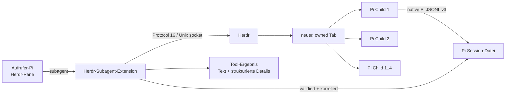
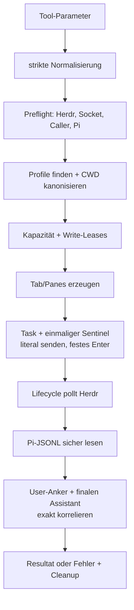
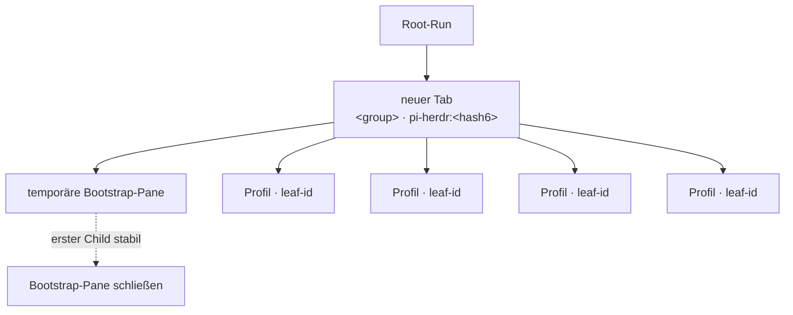
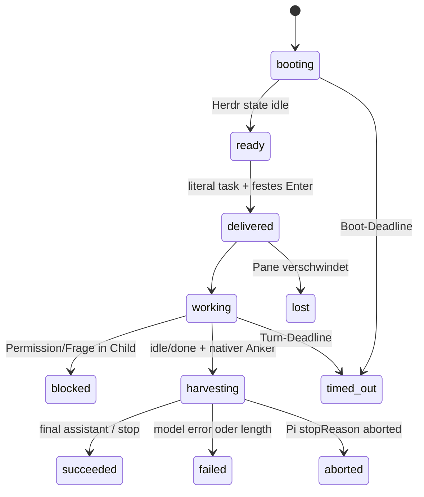
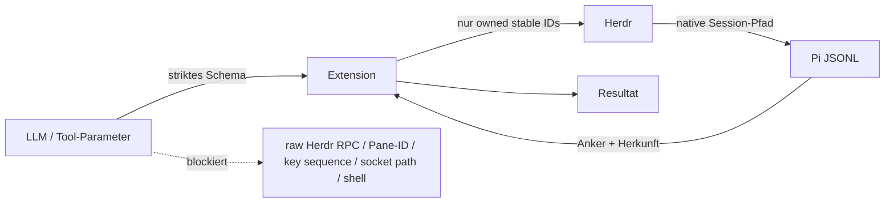
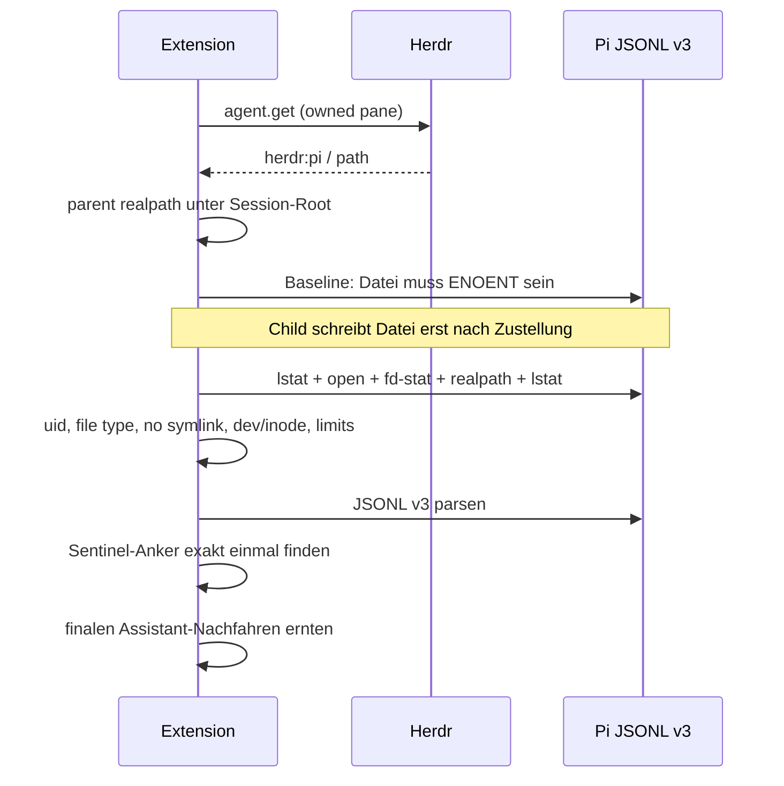

# Herdr Subagent Extension – technischer Überblick

> Implementierungsstand dieses Verzeichnisses. Stand: Pi `0.80.6`, Herdr `0.7.3`, Herdr-Protokoll `16`, Ergebnisprotokoll `1`.

Extension erzeugt sichtbare, interaktive Pi-Unteragenten in Herdr. Sie registriert genau zwei Pi-Tools:

- `subagent` – startet einen Root-Run mit 1–4 Child-Panes.
- `subagent_control` – steuert nur lokal registrierte, nachweislich eigene Child-Panes.

Keine Shell-Remote-Execution-API. Keine freie Tasteneingabe. Keine Bildschirm- oder Terminal-Transcript-Auswertung.

## Inhalt

- [Systembild](#systembild)
- [Voraussetzungen und zentrale Konfiguration](#voraussetzungen-und-zentrale-konfiguration)
- [Agent-Profile](#agent-profile)
- [Aufrufkonfiguration](#aufrufkonfiguration)
- [Ausführungsmodell](#ausführungsmodell)
- [Ergebnisvertrag](#ergebnisvertrag)
- [Steuerung retained/blockierter Runs](#steuerung-retainedblockierter-runs)
- [Sicherheitsmodell](#sicherheitsmodell)
- [Grenzen und bewusste Nicht-Funktionen](#grenzen-und-bewusste-nicht-funktionen)
- [Fehlerbehebung](#fehlerbehebung)
- [Quellcodekarte und Tests](#quellcodekarte-und-tests)

## Systembild



Ein Root-Run besitzt einen neu erzeugten Herdr-Tab. Ein Leaf ist genau ein Child-Pane/ein Child-Pi. Ownership basiert auf stabilen IDs, nicht auf Tab-Label, Pane-Position oder sichtbarem Text.



## Voraussetzungen und zentrale Konfiguration

### Installation/Scope

Pi entdeckt diese Extension global als Verzeichnis-Extension:

```text
~/.pi/agent/extensions/herdr-subagent/index.ts
```

Pi lädt globale Extensions für alle Projekte. Ein `/reload` lädt die Extension erneut. Sie speichert keine eigene JSON-/Settings-Konfiguration. Zentral konfigurierbar sind daher Umgebung, Pi-Ausführungsdatei und Profile.

> Extension-Code läuft mit lokalen Benutzerrechten. Nur vertrauenswürdigen Extension-Code installieren.

### Externe Laufzeitbedingungen

| Bedingung | Zweck | Verhalten bei Fehlen |
|---|---|---|
| Pi läuft in einer Herdr-verwalteten Pane | Bindet Child-Run an echten Herdr-Workspace | `not_in_herdr` |
| `HERDR_ENV=1` | Expliziter Herdr-Kontext | `not_in_herdr` |
| `HERDR_SOCKET_PATH` | Direkter Unix-Socket von Herdr | `missing_herdr_socket` |
| `HERDR_PANE_ID` | Identität der aufrufenden Pane | `calling_pane_not_found` |
| Herdr-Protokoll 16 | Benötigte Herdr-Operationen | `herdr_protocol_unsupported` |
| Herdr-Pi-Integration | Native Child-Pi- und Session-Referenz | `pi_integration_missing` |
| ausführbares `pi` auf `PATH` | Startet Child-Pi | `pi_integration_missing` |

`PI_HERDR_PI_EXECUTABLE` kann `pi` auf `PATH` ersetzen. Wert muss absolut und ausführbar sein; kein Shell-Lookup und keine Installation durch die Extension.

Vor jeder Topologie-Allokation prüft die Extension:

1. `HERDR_ENV`, Socket-Pfad, Caller-Pane und verschachtelten Kontext.
2. Socket ist Socket, kein Symlink, Eigentümer aktueller Benutzer.
3. Protocol-16-Handshake und erforderliche Herdr-Fähigkeiten.
4. Caller-Pane ist in Snapshot vorhanden, hat Workspace und native Pi-Integration.
5. Pi-Datei ist absolut und ausführbar.

Der Herdr-Client begrenzt Connect auf 5 Sekunden, Einzel-Request auf 15 Sekunden, JSON-Frames auf 1 MiB und Request-Payloads auf 64 KiB. Er prüft Socket-Inode/Device/Eigentümer bei Verbindung und nochmals vor dem Schreiben.

### Zentraler Laufzeitspeicher

Koordination liegt ausschließlich im Benutzer-Runtime-Verzeichnis:

```text
${XDG_RUNTIME_DIR:-/tmp}/pi-herdr-subagent-<uid>/
├── capacity.json
├── capacity.lock/owner.json
└── write-<sha256(canonical-cwd)>.json
```

Verzeichnis und Lock-Verzeichnis müssen `0700`, Dateien `0600` sein, dem aktuellen Benutzer gehören und dürfen keine Symlinks sein. Kapazitätslock ist atomar über `mkdir`, mit Token; verwaiste Locks werden erst nach 10 Sekunden und nur bei totem Prozess entfernt. Lock-Wartezeit: 2 Sekunden. Vorläufige Reservierungen/Leases verfallen nach 30 Sekunden, falls keine Pane daran gebunden ist.

### Child-Umgebung

Jeder Child-Pi erhält nur explizite Koordinationswerte; Profiltext, Task und geerbte Umgebung erscheinen nicht im Diagnose-Log:

| Variable | Bedeutung |
|---|---|
| `PI_HERDR_ROOT_RUN_ID` | Root-Run-ID |
| `PI_HERDR_LEAF_RUN_ID` | Leaf-ID |
| `PI_HERDR_PARENT_ROOT_RUN_ID` | Root-ID des Elternruns für Verschachtelung |
| `PI_HERDR_NESTING_DEPTH` | Child-Tiefe |
| `PI_HERDR_GROUP` | sanitisierte Gruppe |
| `PI_HERDR_AGENT_PROFILE` | Profilname |
| `PI_HERDR_SUBAGENT_CHILD=1` | Herdr-spezifische Child-Markierung |
| `PI_SUBAGENT=1` | allgemeine Pi-Subagent-Markierung |

Falls gesetzt und absolut, wird `XDG_RUNTIME_DIR` an Child-Pis weitergegeben. Dadurch teilen verschachtelte Koordinatoren Kapazitäts- und Lease-Sicht. Maximale Child-Tiefe: **3**.

## Agent-Profile

Profile sind Markdown-Dateien mit Frontmatter. Verfügbare Quellen:

| Scope | Verzeichnis | Priorität |
|---|---|---|
| `user` | Pi-Benutzer-Agent-Verzeichnis (`~/.pi/agent/agents/`) | Basis |
| `project` | nächstes `.pi/agents/` aufwärts vom Child-CWD | überschreibt gleichnamiges User-Profil |
| `both` | beide | Projekt gewinnt bei gleichem Namen |

Minimalbeispiel:

```markdown
---
name: scout
description: Schnelle, lesende Repository-Erkundung.
tools:
  - read
  - bash
model: anthropic/claude-sonnet-4-5
---

Finde nur relevante Pfade, Symbole und Tests. Keine Änderungen.
```

| Feld | Pflicht | Wirkung |
|---|---:|---|
| `name` | ja | Auswahlname im Tool-Aufruf |
| `description` | ja | Wird dem aufrufenden Modell im Prompt angezeigt |
| `tools` | nein | Kommagetrennt als `pi --tools …` an Child übergeben |
| `model` | nein | Als `pi --model …` übergeben; Referenz wird validiert |
| Markdown-Body | nein | temporär als Datei geschrieben und via `--append-system-prompt <datei>` angehängt |

Ungültige/unlesbare Profile werden bei Discovery verworfen. Projektprofile benötigen standardmäßig eine UI-Bestätigung. In Non-UI-Modi gibt es keine Dialogfreigabe; Projektprofile können nur mit explizitem `confirmProjectAgents: false` genutzt werden.

Temporäre Prompt-Dateien liegen in einem neuen `0700`-Runtime-Unterordner, werden exklusiv als `0600` erzeugt und nach stabiler Child-Bereitschaft oder Startfehler gelöscht.

> `tools: [edit, write]` ist nur eine deklarative Writer-Klassifikation für Leases. Es ist kein Sandbox-Nachweis und beweist nicht, dass ein Profil tatsächlich schreibt.

## Aufrufkonfiguration

### `subagent`

Alle öffentlichen Objekte sind strikt: unbekannte Felder schlagen fehl. Text wird NFKC-normalisiert und getrimmt.

```ts
type Item = {
  name?: string;       // innerhalb tasks/chain eindeutig nach Normalisierung
  agent: string;       // Profilname
  task: string;        // nicht leer, ohne CR/LF
  cwd?: string;        // vorhandenes Verzeichnis
};

type Launch = {
  group: string;       // 1..60 Unicode-Scalars, terminalsteuerzeichenbereinigt
  agent?: string;      // Single-Modus
  task?: string;
  cwd?: string;
  tasks?: Item[];      // Parallel-Modus, 1..4
  chain?: Item[];      // Ketten-Modus, 1..4
  agentScope?: "user" | "project" | "both"; // Standard: user
  confirmProjectAgents?: boolean;              // Standard: true
  timeoutSeconds?: number;                     // 1..86400, Standard: 1800
  keepOpen?: boolean;                          // Standard: false
  allowSharedWorkspaceWrites?: boolean;        // Standard: false, gefährlich
};
```

Genau ein Ausführungsmodus ist erlaubt:

| Modus | Felder | Semantik |
|---|---|---|
| Single | `agent` und `task`, optional `cwd` | Ein Child-Pi |
| Parallel | `tasks` | 1–4 Child-Pis gleichzeitig |
| Chain | `chain` | 1–4 Child-Pis nacheinander |

`cwd` wird mit `realpath` kanonisiert und muss danach ein bestehendes Verzeichnis sein. Fehlt es bei einem Item, gilt CWD des aufrufenden Pi. Ein Chain-Schritt ersetzt jedes `{previous}` in seiner Task durch den finalen Text des vorherigen erfolgreichen Leafs.

#### Aufrufbeispiele

Single:

```json
{
  "group": "API-Analyse",
  "agent": "scout",
  "task": "Finde die API-Grenzen.",
  "cwd": "/work/service",
  "timeoutSeconds": 300
}
```

Sicher parallele Leser:

```json
{
  "group": "Erkundung",
  "tasks": [
    {"name": "api", "agent": "scout", "task": "Finde API-Grenzen.", "cwd": "/work/service"},
    {"name": "tests", "agent": "scout", "task": "Finde Test-Einstiegspunkte.", "cwd": "/work/service"}
  ]
}
```

Sequentielle Writer im selben Workspace:

```json
{
  "group": "Änderung",
  "chain": [
    {"name": "implement", "agent": "worker", "task": "Implementiere die Änderung.", "cwd": "/work/service"},
    {"name": "verify", "agent": "worker", "task": "Prüfe Ergebnis: {previous}", "cwd": "/work/service"}
  ],
  "keepOpen": true
}
```

### Parallelität, Kapazität, Write-Leases

| Regel | Implementierung |
|---|---|
| maximal 3 verwaltete Tabs pro Workspace | Snapshot-Labels und Runtime-Reservierungen werden konservativ gezählt |
| maximal 4 Panes pro Root-Run | Schema, Kapazität und Layout erzwingen Grenze |
| parallele Writer | müssen unterschiedliche kanonische CWDs haben |
| Writer-Lease | eine atomare Lease pro kanonischem CWD und Root-Run |
| Chain | startet nächsten Pane erst nach Erfolg des vorherigen Leafs |
| Blockierung | verhindert weitere noch nicht gestartete Chain-Schritte |

`allowSharedWorkspaceWrites: true` hebt den Schutz **bewusst** auf. Bei parallelen Writer-Profilen mit gleicher kanonischer CWD wird dann kein exklusiver Lease beansprucht und eine Warnung ins strukturierte Ergebnis geschrieben. Nur setzen, wenn Nutzer das Konfliktrisiko explizit akzeptiert hat.

Keine Worktrees: Extension erstellt, wählt oder verwaltet keine.

## Ausführungsmodell

### Tab und Pane-Topologie



- Tab-Label enthält nur eine kurze Hash-Suffix als Discovery-Hilfe, niemals als alleinigen Ownership-Beweis.
- Pane-Namen enthalten Gruppe, Profil und erste acht Zeichen der Leaf-ID; Terminal-Control-Zeichen werden entfernt.
- Während ein `subagent`-Tool läuft, zeigt dessen Orchestrator-Zeile Gruppe, Modus/Panenanzahl, Item-Name, Profil und eine gekürzte Task. Expansion zeigt die vollständige Task bzw. finale Leaf-Outputs. Modell, Tool-Liste und technische Pane-/Tab-IDs bleiben verborgen: Sie erklären den Run nicht besser als Profil und Gruppe.
- Layouts: 1 Pane; 2 horizontal; 3 horizontal plus rechter vertikaler Split; 4 zwei vertikale Spalten. Layout-Fehler lassen sichere Standardanordnung bestehen und erzeugen Warnung.
- Bootstrap-Pane wird erst nach stabiler erster Child-Pane geschlossen.

### Task-Zustandsautomat



Ablauf pro Turn:

1. Lifecycle pollt Child-Zustand in 250-ms-Intervallen; Events sind nur Beschleunigung, Polling bleibt Autorität.
2. `idle` vor der Zustellung bedeutet ausschließlich *bereit*, nie *fertig*.
3. Extension erwartet Session-Datei zunächst nicht vorhanden und hält diese Abwesenheits-Baseline fest.
4. Task erhält als terminales Suffix exakt einmal einen zufälligen Sentinel: ` [herdr:task-sentinel:v1:<turn-id>]`.
5. Extension sendet einmal den vollständigen literal Task und unmittelbar danach nur festes Enter. Kein automatisches Neusenden.
6. Nach `idle`/`done` sucht sie den nativen User-Eintrag mit genau diesem Sentinel und dann den finalen, davon abstammenden Assistant-Eintrag.
7. Nur dessen Text und Metadaten ergeben Erfolg. Herdr `idle`/`done` allein ist nie Resultatbeweis.

Bei parallelem Start werden alle vorbereiteten Leafs gestartet. Liefert ein Leaf `blocked`, meldet der Root zeitnah `blocked`; bereits gestartete Geschwister dürfen im Hintergrund fertig laufen. Bei Chain endet Start der restlichen Schritte beim ersten Nicht-Erfolg.

### Cleanup und Retention

| Situation | Verhalten |
|---|---|
| Setup-/Startfehler | eigene Panes, Bootstrap-Pane, Prompt-Dateien, Leases, Reservierung best effort zurückrollen |
| Erfolg/Fehler/Timeout, `keepOpen=false` | eigene Panes schließen; Tab nur ohne fremde Pane schließen; Leases/Reservierung freigeben |
| `keepOpen=true` | erfolgreiche Panes und Authority für späteres `follow_up` bleiben erhalten |
| `blocked` | Gruppe bleibt unabhängig von `keepOpen` für manuelle Auflösung/`collect` erhalten |
| fremde Pane im Tab | Tab bleibt offen, Warnung |
| Ownership-Snapshot nicht prüfbar | Tab bleibt offen, Warnung |

Vor Tab-Schließung erfolgt Snapshot-Prüfung und eine zweite Prüfung an der Schließgrenze. Fremde Panes werden nie geschlossen.

## Ergebnisvertrag

Tool-Text ist absichtlich kurz: maximal 400 Unicode-Scalars je erfolgreichem Output/Fehler. Bei noch kontrollierbaren retained Leafs enthält er zusätzlich sichere Handles: `root=<rootRunId>`, Root-Status sowie Name, `leaf=<leafRunId>` und Status jedes erfolgreichen `keepOpen`- oder blockierten Leafs. Diese IDs können direkt in `subagent_control` verwendet werden. Pane-/Tab-IDs, Session-Pfade/-IDs, Marker, Launch-Namen und Umgebung bleiben aus Tool-Text ausgeschlossen. Vollständige Daten liegen in `details`; `finalOutput` bleibt dort unverändert.

```ts
type RootResult = {
  protocolVersion: 1;
  rootRunId: string;
  parentRootRunId?: string;
  nestingDepth: number;
  group: string;
  mode: "single" | "parallel" | "chain";
  status: "succeeded" | "blocked" | "failed" | "aborted" | "timed_out";
  workspaceId: string;
  tabId: string;
  tabLabel: string;
  keepOpen: boolean;
  startedAt: number;
  finishedAt?: number;
  children: LeafResult[];
  warnings: string[];
};

type LeafResult = {
  leafRunId: string;
  name: string;
  agent: string;
  cwd: string;                 // kanonisch
  paneId: string;
  paneLabel: string;
  status: "queued" | "booting" | "working" | "blocked" |
          "succeeded" | "failed" | "aborted" | "timed_out" | "lost";
  piSession?: {
    source: "herdr:pi";
    kind: "path";
    path: string;
    sessionId?: string;
    anchorEntryId?: string;
    finalEntryId?: string;
  };
  blockedReason?: string;
  finalOutput?: string;
  stopReason?: string;
  usage?: unknown;
  error?: { code: ErrorCode; message: string };
};
```

`status: succeeded` heißt: vertrauenswürdige Pi-JSONL, eindeutiger Sentinel-User-Anker, finaler abstammender Assistant-Eintrag mit `stopReason: "stop"` und nichtleerem Text. `length` ist kein Erfolg; `error` und `aborted` werden als Child-Fehler bzw. Abbruch abgebildet.

## Steuerung retained/blockierter Runs

### `subagent_control`

```ts
type Control = {
  action: "status" | "steer" | "follow_up" | "collect" | "abort" | "close";
  rootRunId: string;
  leafRunId?: string;
  message?: string;             // für steer/follow_up, nicht leer, ohne CR/LF
  timeoutSeconds?: number;      // collect/abort, 1..86400
  closeAfterCollect?: boolean;  // nur collect
};
```

| Aktion | Zulässiger Leaf | Wirkung |
|---|---|---|
| `status` | alle | lokaler Registry-Status, keine Live-Operation |
| `steer` | `working` oder `blocked` | literal Text + festes Enter an eigene Pane |
| `follow_up` | erfolgreicher retained Leaf | neuer korrelierter nativer Pi-Turn |
| `collect` | `blocked`, `working`, `succeeded` | vorhandenen aktiven Turn sicher ernten |
| `abort` | `booting`, `working`, `blocked` | festes Ctrl-C-Kandidaten-Signal, dann schließen |
| `close` | eigene Leafs | eigene Pane schließen, Tab nur ohne fremde Pane |

Bei mehreren für eine Aktion passenden Leafs muss `leafRunId` gesetzt werden, sonst `ambiguous_turn`. `status` und `close` dürfen mehrere Leafs betreffen.

Beispiele:

```json
{"action":"status","rootRunId":"<root>"}
{"action":"follow_up","rootRunId":"<root>","leafRunId":"<leaf>","message":"Fasse Ergebnis zusammen."}
{"action":"collect","rootRunId":"<root>","leafRunId":"<leaf>","closeAfterCollect":true}
{"action":"close","rootRunId":"<root>"}
```

`follow_up` verlangt zusätzlich: ursprünglicher lokal registrierter Run mit `keepOpen: true`, Leaf `succeeded`, aktiver adressierbarer Herdr-Agent mit exakt registrierter Pane-ID und Zustand `idle`/`done`. Herdr-gelieferte Root-/Leaf-Metadaten sowie Agent-/Session-Namen müssen, falls vorhanden, exakt zum Launch passen. `agent_session.source` muss `herdr:pi` sein; vertrauenswürdiger Pfad und Session-ID müssen unverändert bleiben. Fehlende oder abweichende Evidenz liefert nichts aus. Ein atomarer Registry-Claim verhindert zwei parallele Follow-ups; nach nativem Final darf derselbe Leaf erneut folgen.

Bei mehreren eligible Leafs `leafRunId` explizit setzen; eine angezeigte Handle-Auswahl stets übernehmen. Bei `blocked`: Frage/Permission sichtbar in der eigenen Child-Pane lösen, anschließend `collect`; bis Erfolg ist kein Follow-up möglich. Danach retained Panes mit `close` freigeben. `steer` kann Text senden, ist aber kein Beweis, dass eine interaktive Blockierung korrekt aufgelöst wurde.

`abort` wartet höchstens eine Sekunde (auch bei höherem Parameterwert) und meldet immer `abortCandidateSent: true`, `gracefulAbortProven: false`. Es darf nie als nachgewiesen sanfter Pi-Abbruch interpretiert werden.

## Sicherheitsmodell

### Öffentliche Grenze



| Schutz | Konkrete Umsetzung |
|---|---|
| Eingabevalidierung | unbekannte Felder verboten; genau ein Modus; Bounds 1–4 und 1–86400; Tasks/Messages CR/LF-frei |
| Label-Injection | Gruppe/Panenamen NFKC-normalisiert; ANSI/OSC/C0-Control-Zeichen entfernt; Längen begrenzt |
| Socket-Trust | aktueller Benutzer, direkter Nicht-Symlink-Socket, Device/Inode-Revalidierung beim Connect und vor Write |
| Herdr-Protokoll | enger Protocol-16-Client; feste Methodenauswahl; serialisierte Requests; Frame/Payload-Limits; Fehler ohne Frame-Body |
| Kein Tastatur-Backdoor | öffentlich keine Keys; intern nur festes Enter für Zustellung und festes Ctrl-C für Abbruch |
| Kein frei wählbares Ziel | öffentliche Tools nehmen keine Socket-, Tab- oder Pane-ID entgegen |
| Ownership | lokale Root/Leaf-Registry plus aktueller adressierbarer Herdr-Agent mit exakter registrierter Pane-ID; Parent darf eigene Nachfahren steuern, nie Vorfahren/Geschwister/fremde Runs |
| Session-Trust | nur `source: herdr:pi`, `kind: path`, absoluter Pfad unter kanonischem Session-Root |
| TOCTOU-Schutz | Datei zunächst muss fehlen; non-symlink/current-user regular file; `lstat`/offener FD/Inode/Realpath vor Lesen erneut verglichen |
| Parser-Grenzen | höchstens 4 MiB Session, 256 KiB pro JSONL-Zeile, v3-Header und wohlgeformte Entries |
| Ergebnis-Korrelation | Sentinel genau einmal als User-Terminal-Suffix; finaler Assistant muss Nachfahre sein; interleavte Inputs werden abgelehnt |
| Schreibschutz | kanonische CWD-Leases für deklarierte `edit`/`write`-Profile; expliziter unsicherer Override mit Warnung |
| Ressourcenbegrenzung | höchstens 3 Tabs/Workspace, 4 Panes/Group, Nesting-Tiefe 3, Timeouts |
| Cleanup | nur nachgewiesen eigene Pane; Tab bleibt bei fremder/unklarer Ownership offen |

### Session-Vertrauenskette



Es gibt keine `completion.json`-Sidecar-Datei. Sidecars, Pane-Screen-Scraping und Terminal-Transcript-Scraping wären schwächere, nicht ausreichend korrelierte Evidenz.

### Wichtige Autoritätsgrenze

Run-Registry und Release-Hooks sind pro Extension-Prozess im Speicher. Nach Reload/Prozessende existiert für `subagent_control` keine automatische persistente Authority. `RunRegistry.recover` ist als fail-closed Snapshot-Recovery-Baustein implementiert, aber vom öffentlichen Toolpfad derzeit nicht aufgerufen. Alte Run-IDs daher nicht erraten oder als steuerbar ansehen.

## Grenzen und bewusste Nicht-Funktionen

- Keine Ausführung außerhalb einer Herdr-verwalteten Pi-Pane.
- Keine automatische Herdr-, Pi- oder Integration-Installation.
- Keine Worktrees, Container, Sandbox oder Dateizugriffs-Isolation.
- Keine freie Herdr-RPC-Methode, Shell-Befehl, Socket-Pfad, Auth-Material, Pane/Tab-ID oder Tastenkombination im Toolvertrag.
- Keine Kontrolle fremder/unklarer oder nicht lokal registrierter Runs.
- Kein Ergebnis aus `idle`/`done` ohne korrelierte native Pi-JSONL.
- Kein automatisches Neusenden einer Task nach verzögertem Flush/Ereignisverlust.
- Kein mehrzeiliger `task` oder `message`: Protokoll akzeptiert nur newline-freien literal Text.
- Keine Garantie, dass deklarierte Nicht-Writer nicht schreiben oder deklarierte Writer tatsächlich schreiben; Klassifikation ist Koordinationshilfe, keine Sandbox.
- Kein belegter graceful abort; Ctrl-C ist nur Kandidat.

## Fehlerbehebung

| Code | Aktion |
|---|---|
| `not_in_herdr` | Pi aus einer Herdr-verwalteten Pane neu starten. |
| `missing_herdr_socket` / `herdr_socket_unreachable` | Herdr und Pi als gleicher Benutzer neu starten; keinen Symlink-Socket verwenden. |
| `herdr_protocol_unsupported` | Herdr auf Protocol 16 mit benötigten Fähigkeiten aktualisieren. |
| `calling_pane_not_found` | Pi in live Herdr-Workspace-Pane neu starten. |
| `pi_integration_missing` | Herdr-Pi-Integration aktivieren; ausführbares Pi konfigurieren; neu starten. |
| `agent_profile_not_found` / `agent_profile_invalid` | Profil im gewählten Scope anlegen/reparieren. |
| `project_agent_not_confirmed` | Projektprofil bestätigen oder User-Scope verwenden. |
| `invalid_execution_mode` / `invalid_group` | Strict Schema, Modus, CWD, Task/Message, Timeout und Gruppe korrigieren. |
| `tab_capacity_exceeded` / `pane_capacity_exceeded` | retained Gruppen schließen oder Anzahl reduzieren. |
| `nesting_depth_exceeded` | Bei Tiefe 3 zurück zum flacheren Aufrufer. |
| `shared_workspace_write_conflict` | verschiedene kanonische CWDs oder `chain`; Override nur bewusst. |
| `tab_create_failed` / `agent_start_failed` | Herdr/Pi/Profil prüfen; nach Cleanup neu starten. |
| `child_boot_timeout` / `turn_timeout` | sichtbare Child-Pane prüfen; ggf. schließen; mit sinnvoll größerem Timeout neu starten. |
| `task_delivery_failed` / `task_anchor_missing` | Nicht blind erneut senden; Child prüfen/schließen, neuen Run starten. |
| `child_blocked` | Frage manuell im eigenen Pane lösen, dann `collect`; sonst `close`. |
| `pane_lost` | Keine Steuerung mehr; neuen Run starten. |
| `session_reference_missing` / `session_path_untrusted` / `session_parse_failed` | Output nicht vertrauen; eigene Pane schließen, neuen Run starten. |
| `ambiguous_turn` | berechtigte `leafRunId` explizit angeben; Ziel nicht raten. |
| `empty_final_output` / `result_unavailable` | Child offen halten, später `collect`; sonst schließen und neu starten. |
| `child_model_error` / `child_aborted` | Child-Ergebnis prüfen; bei Bedarf als neuer Run wiederholen. |
| `cleanup_incomplete` | Warnungen lesen; nur nachweislich eigene Ressourcen manuell entfernen. |
| `unknown_or_foreign_run` | Nicht steuern; nur lokal registrierte, ownership-belegte Runs sind kontrollierbar. |

## Quellcodekarte und Tests

| Datei | Verantwortung |
|---|---|
| `index.ts` | Pi-Registrierung, Preflight-/Launch-Orchestrierung, Resultatbildung |
| `contracts.ts` | strikte Tool-Schemas, Defaults, Fehlercodes, Normalisierung |
| `agent-profiles.ts` | User-/Projekt-Discovery, Profilvalidierung und Override |
| `preconditions.ts` | Herdr-/Socket-/Caller-/Pi-Preflight, Nesting-Grenze |
| `herdr-client.ts` | enger Protocol-16-JSONL-Client mit Socket-/Frame-Schutz |
| `capacity.ts` | Cross-Process-Kapazität, atomare Locks, Writer-Leases |
| `topology.ts` | Tab/Panes/Layout, ownership-sicherer Rollback/Cleanup |
| `pi-launch.ts` | Child-Pi-Argumente, temporärer Systemprompt, Child-Env |
| `task-delivery.ts` | newline-freie Task und eindeutiger Sentinel |
| `lifecycle.ts` | Zustandsautomat, Polling, Zustellung, Timeout/Abbruch |
| `pi-session.ts` | Pfad-/Datei-Trust, bounded JSONL-v3-Parser, Ergebnisernte |
| `run-registry.ts` | prozesslokale Ownership, Control-Resolution, Follow-up-Claim |
| `control.ts` | `subagent_control`, Live-Validierung, collect/close/abort |
| `result-format.ts` | kompakter Tool-Text, vollständige strukturierte Details |

Unit-/Integrations-Tests liegen neben den Modulen als `*.test.ts`. Vorgesehene Suite:

```bash
bun test
```

Opt-in Live-Test gegen reale Herdr/Pi-Umgebung:

```bash
HERDR_G4_LIVE=1 bun test index.live.test.ts
```
